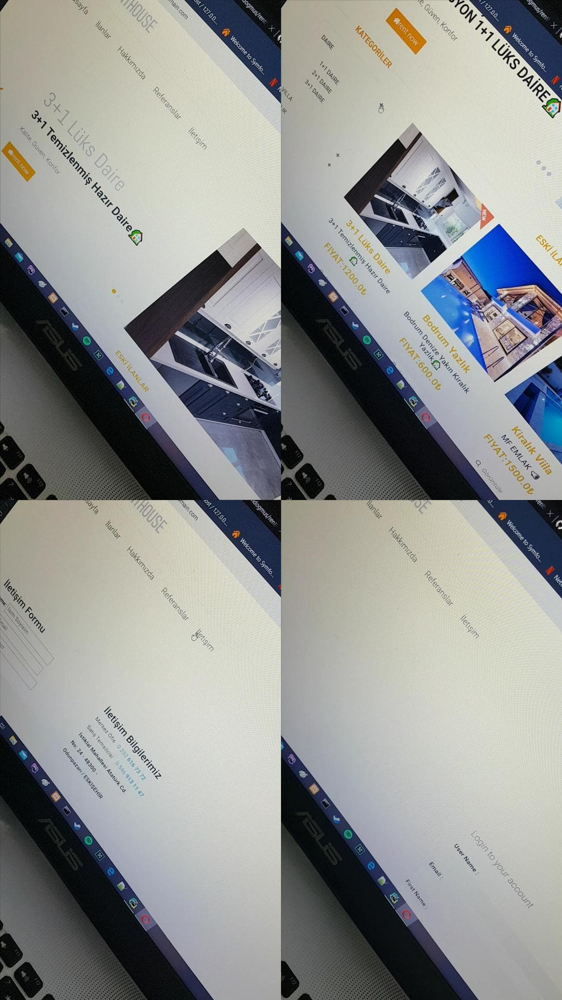

# Real Estate

This project is a multilingual and multi-currency e-commerce real estate web project developed using the Python Django Framework.

## Before running this project you need install below list apps and packages

Install Python 3.7 or above -> https://www.python.org/ 
Install Pip   -> python get-pip.py 

pip install Django 
pip install django-admin-thumbnails 
pip install django-ckeditor 
pip install django-currencies 
pip install django-mptt 
pip install Pillow 

## For running

python manage.py runserver

# Home Pages
 

